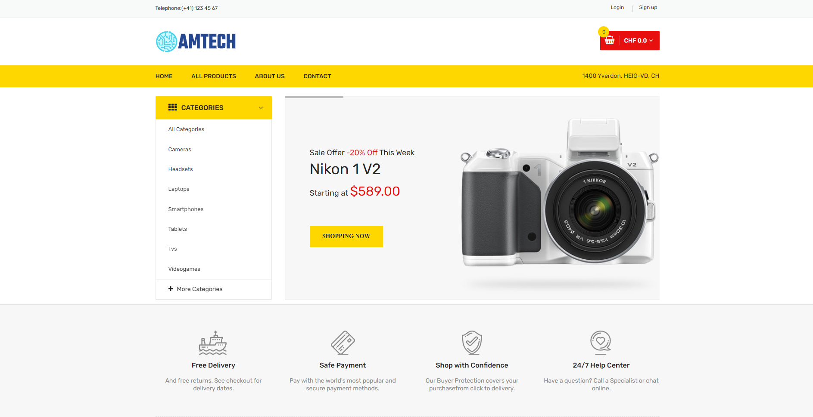

[![Contributors][contributors-shield]][contributors-url]
[![Forks][forks-shield]][forks-url]
[![Stargazers][stars-shield]][stars-url]
[![Issues][issues-shield]][issues-url]
[![MIT License][license-shield]][license-url]

<div align="center">
  <h2>AMTech Project</h2>
  <p>
    The AMTech Project is a school practical project that aims to extend our skills on web app development and team work.
    <br />
    <a href="https://github.com/Ga-3tan/AMT_Project/wiki"><strong>Explore the wiki »</strong></a>
    <br />
  </p>
</div>


<!-- TABLE OF CONTENTS -->

<details>
  <summary>Table of Contents</summary>
  <ol>
    <li>
      <a href="#about-the-project">About The Project</a>
      <ul>
        <li><a href="#built-with">Built With</a></li>
      </ul>
    </li>
    <li>
      <a href="#getting-started">Getting Started</a>
      <ul>
        <li><a href="#prerequisites">Prerequisites</a></li>
        <li><a href="#installation">Installation</a></li>
      </ul>
    </li>
    <li><a href="#usage">Usage</a></li>
    <li><a href="#contributing">Contributing</a></li>
    <li><a href="#license">License</a></li>
    <li><a href="#contact">Contact</a></li>
  </ol>
</details>


<!-- ABOUT THE PROJECT -->

## About The Project

We developed an e-commerce website, selling high-tech consumer products. Here is our home page :



### Built With

* [Spring](https://spring.io/)
* [MongoDB](https://www.mongodb.com/)
* [AWS](https://https://aws.amazon.com/)
* [Thymeleaf](https://www.thymeleaf.org/)

<!-- GETTING STARTED -->

## Getting Started

### Prerequisites

You need the following components to use the projet, please make sure you have installed them :

* [Java 11](https://jdk.java.net/11/)
* [Maven 3.6.0](https://maven.apache.org/install.html)
* [Docker](https://docs.docker.com/get-docker/)
* IDE of your choice (we used [IntelliJ IDEA](https://www.jetbrains.com/fr-fr/idea/))

### Installation

#### Production version

Ask the team for AWS SSH connection instructions.

No installation needed, see [usage](#Usage) to use the app in production version.

#### Development version (local)

1. Clone the repo.

```sh
git clone https://github.com/Ga-3tan/AMT_Project.git
```

2. Start the local mongoDB database in a docker container.

```sh
#Run this command in AMT_Project/db-dev/
docker-compose up -d
```

3. The app authentication procedures works in combination with another service. If you want to try the webapp with the authentication feature you will also have to install the following project: [Authentication service project](https://github.com/Alessandro-AP/JWTAuthentication) (follow instructions on the project README for installation)

## Usage

### Production version

1. Follow the team's instructions to establish a SSH connection with the application, then you can connect to it with the following address : http://localhost:8081.
2. Play with the app (to try the app in admin privileges, please contact the team).

### Development version

1. Open the project in your favorite IDE. and run the Application.
2. If you use the authentication service, you will need to add the JWT secret to the environment variable of your IDE (or in the application.properties) and adapt ligne 17 of the `JwtUtil.java` file accordingly (set it to the defined environment variable or property in the application.properties). The JWT secret can be found in the `application.properties` of the [Authentication service project](https://github.com/Alessandro-AP/JWTAuthentication).
3. Run the Application with your IDE.
4. Connect to the application with the following address : http://localhost:8080.
5. Play with the app (to try the app in admin privileges, see the README of the [Authentication service project](https://github.com/Alessandro-AP/JWTAuthentication)).
<br>

------

<!-- CONTRIBUTING -->

## Contributing

1. Clone the repo

```sh
git clone https://github.com/Ga-3tan/AMT_Project.git
```

2. Start the local mongoDB database in a docker container

```sh
#Run this command in AMT_Project/db-dev/
docker-compose up -d
```

3. In the project root, enable git flow (use default configuration)

```sh
#AMT_Project/
git flow init
```

4. Create a branch (see below), open your favorites IDE and start coding

5. If needed, clone the Authentication service

```sh
git clone https://github.com/Alessandro-AP/JWTAuthentication.git
```

6. See [here (point 2)](#development-version) to setup the JWT secret.

#### New Feature

1. Use **git flow** to create features

```sh
git flow feature start feature_branch
```

2. To end a feature and merge it in the develop branch

```sh
git flow feature finish feature_branch
```

#### Release branch

##### **Create a release branch**

Once a feature is ready for a release, a release branch is forked off of the develop branch by using the following command:

```sh
git flow release start '[version tag]'
```
##### **Finish a release branch**

Once the release is ready to ship, it will get merged it into main and develop, then the release branch will be deleted.

```sh
git flow release finish '[version tag]'
```

_Note: It’s important to merge back into develop because critical updates may have been added to the release branch and they need to be accessible to new features._

#### Hot fix branch

Hotfix branches are a lot like release branches and feature branches except they're based on main instead of develop. __This is the only branch that should fork directly off of main.__

As soon as the fix is complete, it should be merged into both main and develop (or the current release branch), and main should be tagged with an updated version number.

A hotfix branch can be created using the following methods:

   ```sh
git flow hotfix start hotfix_branch
   ```

Then merge the branch to main and develop branch as usual:

   ```sh
git checkout main
git merge hotfix_branch
git checkout develop
git merge hotfix_branch
git branch -D hotfix_branch
   ```

Once done, use the following command to finish the hot fix branch:

   ```sh
git flow hotfix finish hotfix_branch
   ```


<p align="right">(<a href="#top">back to top</a>)</p><br />

---
<!-- CONTACT -->

## Contact
[Alessandro Parrino](https://github.com/Alessandro-AP) <br>
[Daniel Sciarra](https://github.com/DS-Daniel) <br>
[Marco Maziero](https://github.com/MazieroMarco) <br>
[Gaétan Zwick](https://github.com/Ga-3tan) <br>
[Anh Mai Hoang](https://github.com/MaIT-HgA) <br>

Project Link: [https://github.com/Ga-3tan/AMT_Project](https://github.com/Ga-3tan/AMT_Project)

<!-- MARKDOWN LINKS & IMAGES -->
<!-- https://www.markdownguide.org/basic-syntax/#reference-style-links -->

[contributors-shield]: https://img.shields.io/github/contributors/Ga-3tan/AMT_Project.svg?style=for-the-badge
[contributors-url]: https://github.com/Ga-3tan/AMT_Project/graphs/contributors
[forks-shield]: https://img.shields.io/github/forks/Ga-3tan/AMT_Project.svg?style=for-the-badge
[forks-url]: https://github.com/Ga-3tan/AMT_Project/network/members
[stars-shield]: https://img.shields.io/github/stars/Ga-3tan/AMT_Project.svg?style=for-the-badge
[stars-url]: https://github.com/Ga-3tan/AMT_Project/stargazers
[issues-shield]: https://img.shields.io/github/issues/Ga-3tan/AMT_Project.svg?style=for-the-badge
[issues-url]: https://github.com/Ga-3tan/AMT_Project/issues
[license-shield]: https://img.shields.io/github/license/Ga-3tan/AMT_Project.svg?style=for-the-badge
[license-url]: https://github.com/Ga-3tan/AMT_Project/blob/master/LICENSE
[product-screenshot]: readme_images/screenshot.png

<!-- LICENSE -->

## License

Distributed under the MIT License. See `LICENSE.txt` for more information.

<p align="right">(<a href="#top">back to top</a>)</p>

