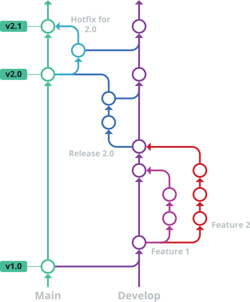

<div id="top"></div>

[![Contributors][contributors-shield]][contributors-url]
[![Forks][forks-shield]][forks-url]
[![Stargazers][stars-shield]][stars-url]
[![Issues][issues-shield]][issues-url]
[![MIT License][license-shield]][license-url]

<!-- PROJECT LOGO -->
<br />

<div align="center">
  <a href="https://github.com/github_username/repo_name">
    <!--  -->
  </a>


<h3 align="center">AMTech Project</h3>

  <p align="center">
    The AMTech Project is a school practical project that aims to extend our skills on web app developpment and team work.
    <br />
    <a href="https://github.com/Ga-3tan/AMT_Project/wiki"><strong>Explore the wiki »</strong></a>
    <br />
  </p>

</div>


<!-- TABLE OF CONTENTS -->

<details>
  <summary>Table of Contents</summary>
  <ol>
    <li>
      <a href="#about-the-project">About The Project</a>
      <ul>
        <li><a href="#built-with">Built With</a></li>
      </ul>
    </li>
    <li>
      <a href="#getting-started">Getting Started</a>
      <ul>
        <li><a href="#prerequisites">Prerequisites</a></li>
        <li><a href="#installation">Installation</a></li>
      </ul>
    </li>
    <li><a href="#usage">Usage</a></li>
    <li><a href="#contributing">Contributing</a></li>
    <li><a href="#license">License</a></li>
    <li><a href="#contact">Contact</a></li>
  </ol>
</details>


<!-- ABOUT THE PROJECT -->

## About The Project

<!-- [![Product Name Screen Shot][product-screenshot]](https://example.com) -->

Here's a blank template to get started: To avoid retyping too much info. Do a search and replace with your text editor for the following: `github_username`, `repo_name`, `twitter_handle`, `linkedin_username`, `email`, `email_client`, `project_title`, `project_description`

### Built With

* [Spring](https://spring.io/)
* [MongoDB](https://www.mongodb.com/)
* [AWS](https://https://aws.amazon.com/)
* [Thymeleaf](https://www.thymeleaf.org/)

<!-- GETTING STARTED -->

## Getting Started

### Prerequisites

* Java 11
* Maven 3.6.0
* Docker

Before executing the code you must install the database mongoDB in a docker container, to do this you must open a terminal go to the folder `/src/main/resources/db-local/` and execute the command `docker-compose up`.

<!-- CONTRIBUTING -->

## Contributing

1. Clone the repo

   ```sh
   git clone https://github.com/Ga-3tan/AMT_Project.git
   ```

### Please use Git Flow :

Gitflow is an alternative Git branching model that involves the use of feature branches and multiple primary branches.

The flow is composed by one main branch and one developpment (sprint) branch. The sprint branch is merged to the main at every end of sprint. During developpment you should create some feature branch from the developpment branch to add new features.



#### Initialization
After installing GitFlow (you should already have it with Git by default), you can use ```git flow init``` to set the sprint branch as the develop branch in Gitflow model.


_Note: As mentioned above, this branch is used for the history of the project. Also, one can set freely a different branch name._

#### New feature
_Reminder: Each new feature should reside in its own branch. feature branches use develop as their parent branch. When a feature is complete, it gets merged back into develop branch. Features should never interact directly with main._

* Create a new feature branch
   ```sh
   git flow feature start feature_branch
   ```
  The developer can now continue to work (with Git) normally.

* Finish a feature branch
   ```sh
   git flow feature finish feature_branch
   ```
  The ```feature_branch``` is now merged to develop branch.

#### Release branch
Once a feature is ready for a release, a release branch is forked off of the develop branch by using the following command:


Once the release is ready to ship, it will get merged it into main and develop, then the release branch will be deleted.

_Note: It’s important to merge back into develop because critical updates may have been added to the release branch and they need to be accessible to new features._

To finish a release branch, use the following methods:
   ```sh
   git flow release finish '0.1.0'
   ```

#### Hot fix branch
Hotfix branches are a lot like release branches and feature branches except they're based on main instead of develop. __This is the only branch that should fork directly off of main.__

As soon as the fix is complete, it should be merged into both main and develop (or the current release branch), and main should be tagged with an updated version number.

A hotfix branch can be created using the following methods:
   ```sh
   git flow hotfix start hotfix_branch
   ```
Then merge the branch to main and develop branch as usual:
   ```sh
    git checkout main
    git merge hotfix_branch
    git checkout develop
    git merge hotfix_branch
    git branch -D hotfix_branch
   ```
Once done, use the following command to finish the hot fix branch:
   ```sh
   git flow hotfix finish hotfix_branch
   ```

<p align="right">(<a href="#top">back to top</a>)</p><br />

---

<!-- LICENSE -->

## License

Distributed under the MIT License. See `LICENSE.txt` for more information.

<!-- CONTACT -->

## Contact

Project Link: [https://github.com/Ga-3tan/AMT_Project](https://github.com/Ga-3tan/AMT_Project)

<!-- MARKDOWN LINKS & IMAGES -->
<!-- https://www.markdownguide.org/basic-syntax/#reference-style-links -->

[contributors-shield]: https://img.shields.io/github/contributors/Ga-3tan/AMT_Project.svg?style=for-the-badge
[contributors-url]: https://github.com/Ga-3tan/AMT_Project/graphs/contributors
[forks-shield]: https://img.shields.io/github/forks/Ga-3tan/AMT_Project.svg?style=for-the-badge
[forks-url]: https://github.com/Ga-3tan/AMT_Project/network/members
[stars-shield]: https://img.shields.io/github/stars/Ga-3tan/AMT_Project.svg?style=for-the-badge
[stars-url]: https://github.com/Ga-3tan/AMT_Project/stargazers
[issues-shield]: https://img.shields.io/github/issues/Ga-3tan/AMT_Project.svg?style=for-the-badge
[issues-url]: https://github.com/Ga-3tan/AMT_Project/issues
[license-shield]: https://img.shields.io/github/license/Ga-3tan/AMT_Project.svg?style=for-the-badge
[license-url]: https://github.com/Ga-3tan/AMT_Project/blob/master/LICENSE
[product-screenshot]: readme_images/screenshot.png
## License
[MIT](https://choosealicense.com/licenses/mit/)

<p align="right">(<a href="#top">back to top</a>)</p>

